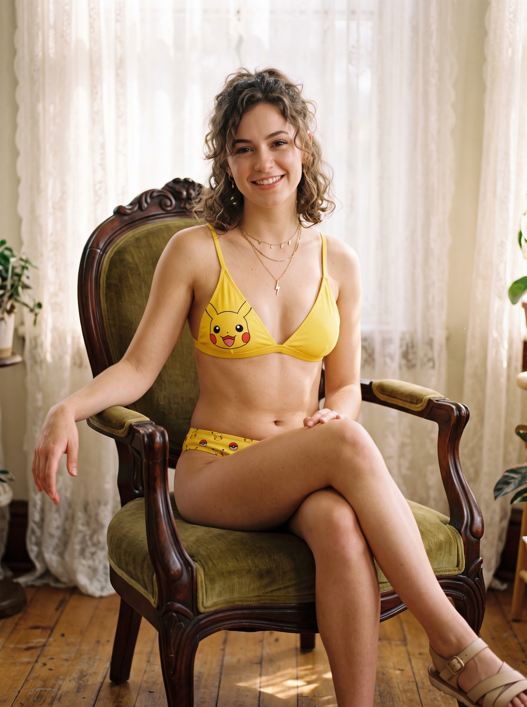

# ⚡ 皮卡丘夢幻比基尼（Pikachu Bikini Landing Page）

> **AI 多模態與本地模型協同實驗專案**  
> 一個從單張參考圖出發，透過多模態影像生成、本地大語言模型視覺推理，並結合 `ui-ux-pro-max` 設計技能全自動構建的一頁式電商展示頁面（Landing Page）。

---

## 🌟 專案核心理念與工作流 (Workflow)

本專案展示了現代 Generative AI 與 Local Agent 在電商行銷頁面（Landing Page）快速落地的一體化流程：

```
[線上參考圖]
18d732bc-*.jpg 
      │
      ▼ (Gemini 影像重構 / 生成)
[高解析商品圖]
product.jpg
      │
      ▼ (多模態推理 + 提示詞引導)
[本地模型：千問 Qwen 3.6 + ui-ux-pro-max 技能]
      │ ├─ 提取商品視覺語義（色調、材質、剪裁細節、目標客群）
      │ ├─ 自動推論商品文案、賣點結構與行銷策略
      │ └─ 注入暖色調夏日美學與響應式 UI 佈局規範
      ▼
[最終成品]
index.html (高質感單頁式電商頁面)
```

---

## 🛠️ 技術棧與工具鏈

| 階段 | 使用工具 / 模型 | 說明 |
| :--- | :--- | :--- |
| **視覺素材生成** | **Google Gemini** | 根據原始參考圖重新生成擬真且符合商品定位的高解析度情境照 (`product.jpg`)。 |
| **多模態推論與文案** | **Qwen 2.5 / 3.6 (本地模型)** | 本地模型進行圖像特徵推論，產出商品名稱、賣點文案、規格特色與定價策略結構。 |
| **UI/UX 設計規範** | **`ui-ux-pro-max` 技能** | 注入專業配色方案（溫暖陽光黃、拿鐵棕色調）、排版字型（Google Noto Sans TC）與微互動設計。 |
| **前端實作** | **HTML5 + CSS3 + Vanilla JS** | 零外部肥大框架依賴，純原生實現響應式排版（RWD）、尺碼切換與購物車互動。 |

---

## 🖼️ 視覺素材對照

| 原始線上參考圖 | Gemini 重新生成商品照 (`product.jpg`) |
| :---: | :---: |
|  |  |

---

## 📂 專案檔案結構

```text
.
├── 18d732bc-aee9-4e90-b6fe-a5bdac0855e2.jpg  # 原始線上參考圖
├── product.jpg                                 # Gemini 生成之最終商品主圖
├── index.html                                  # 核心網頁（由本地模型結合 UI/UX 技能生成）
├── .gitignore                                  # Git 忽略設定
└── README.md                                   # 專案說明與實驗工作流紀錄
```

---

## ✨ 頁面特色與亮點

1. **視覺風格契合**：以明亮溫暖的夏日暖黃（`#FFD54F`）搭配沉穩的大地棕（`#5D4037`），完美呼應皮卡丘與海灘度假氛圍。
2. **結構化電商佈局**：
   - **Hero 橫幅**：標示 2025 限定標籤與引人入勝的情境文案。
   - **商品主展示區**：大圖比例配上即時尺寸選擇（S/M/L/XL）與數量調節器。
   - **特色標籤清單**：突顯「掛脖設計」、「柔軟快乾」、「顯白暖黃」等 AI 推理出的商品核心賣點。
   - **三大價值卡片**：顯白、舒適、吸睛，強化購買動機。
3. **無障礙與輕量**：單一靜態 HTML 檔即可直接運行，相容 GitHub Pages 線上預覽。

---

## 📌 免責聲明 (Disclaimer)

- 本專案僅供 **AI 輔助 UI/UX 設計與多模態推理技術研究/概念驗證 (PoC)** 用途。
- 專案中所提及之「皮卡丘」相關形象版權均屬原創作者及任天堂 / The Pokémon Company 所有。
